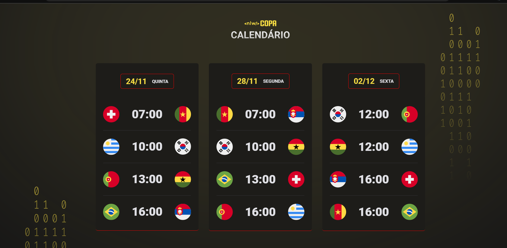

#  Calendário da copa 2022 <NLW - Copa: Trilha Explorer/> ⚽

<h2 align="center"> Prévia do Layout </h2>
  

 

    
 Projeto realizado utilizando:  
    
    
    
 
  
 
##

## Descrição 📝

  <ul>
    <li>
Projeto idealizado pela <i><a href="https://github.com/Rocketseat">@Rocketseat</a></i>🚀 
</li>
    <li>Autor : <a href="https://github.com/BerserKess">Kesley Rainery</a>
</li>
    <li>
Proposta: Construir um site para visualização dos jogos da Copa do Mundo do Qatar de 2022
</li>
    <li>
Status: <b>Em desenvolvimento</b> :warning:
</li>
   </ul>
   

